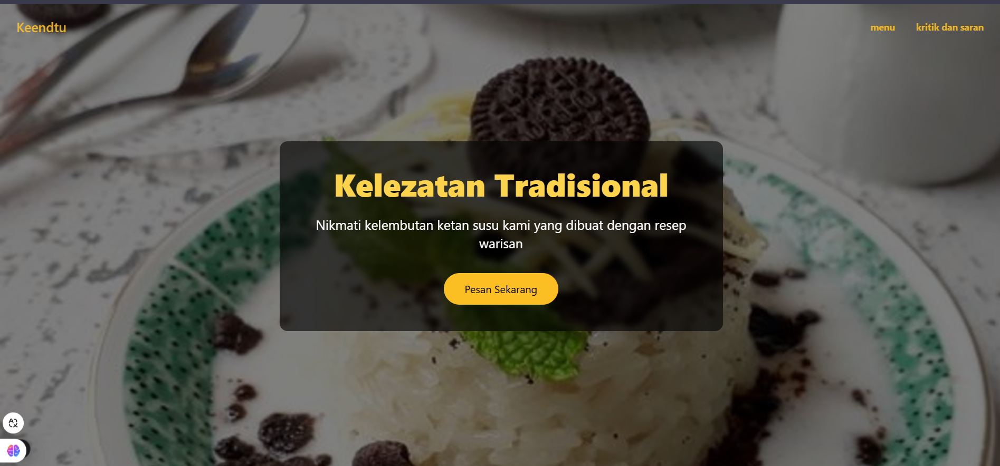

## 🔥Own project

website ketan susu website ini akan digunakan untuk mempermudah calon pelanggan untuk mendapatkan informasi seperti
berapa harga nya bisa di tambah topping apa saja dan juga bisa digunakan menjadi alat sarana dan prasarana untuk
memberikan kritik saran usulan dan komentar

## 📸 Screenshot



This is a [Next.js](https://nextjs.org) project bootstrapped with
[`create-next-app`](https://nextjs.org/docs/app/api-reference/cli/create-next-app).

## Getting Started

First, run the development server:

```bash
npm run dev
# or
yarn dev
# or
pnpm dev
# or
bun dev
```

Open [http://localhost:3000](http://localhost:3000) with your browser to see the result.
